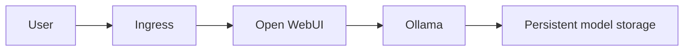

# AI Infrastructure: Ollama and Open WebUI on Kubernetes

This project provides a portfolio reference for running **Ollama** and **Open WebUI** in a private Kubernetes namespace. It demonstrates persistent storage, readiness and liveness probes, service discovery, ingress exposure, and an optional GPU overlay.

> The default manifests are for a non-production CPU-oriented proof of concept. Run model workloads only in an isolated cluster after reviewing image provenance, model licensing, GPU availability, storage capacity, ingress authentication, and network policy requirements.

## Architecture



## Deploy

```bash
kubectl kustomize .
kubectl apply -k .
kubectl get pods,svc,pvc -n ollama
```

Use the GPU overlay only on nodes labelled `accelerator=nvidia` with the NVIDIA device plugin installed:

```bash
kubectl apply -k overlays/gpu
```

## Validate and Remove

```bash
kubectl rollout status deployment/ollama -n ollama
kubectl rollout status deployment/open-webui -n ollama
kubectl get endpoints -n ollama
kubectl delete -k .
```

## Notes

- Do not commit downloaded model files or real ingress hostnames.
- Replace the example ingress host and add TLS before any internet exposure.
- Use a secret manager or an external secret operator for credentials in a production deployment.

See [`docs/PROJECT_STATUS.md`](docs/PROJECT_STATUS.md) for intended scope and constraints.
